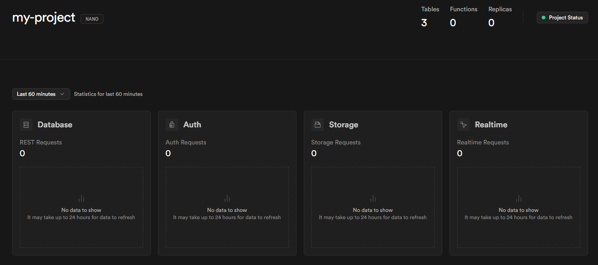
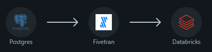

# Projeto Databricks

Objetivos:
Ingerir dados de 2 APIs (Bitcoin e commodities) com scripts Python.
Agendar execuções recorrentes (cron/Jobs) a cada 10 minutos.
Persistir dados na camada raw e promover para bronze com DLT.

### Etapa 1: Criando banco de dados na nuvem

Primeiramente foi necessário criar um projeto no Supabase, criando um banco de dados PostgreSQL, servindo como fonte de dados, simulando um ERP.

### Etapa 2: Injestão de dados no Databricks utilizando o Fivetran e Python

Utilizando o Fivetran, foi realizado a conexão do Fivetran com o Supabase e o Databricks, realizando a ingestão das tabelas no esquema `raw_public` no databricks.

### Etapa 3: Configuração de jobs e pipeline no Databricks

As jobs 